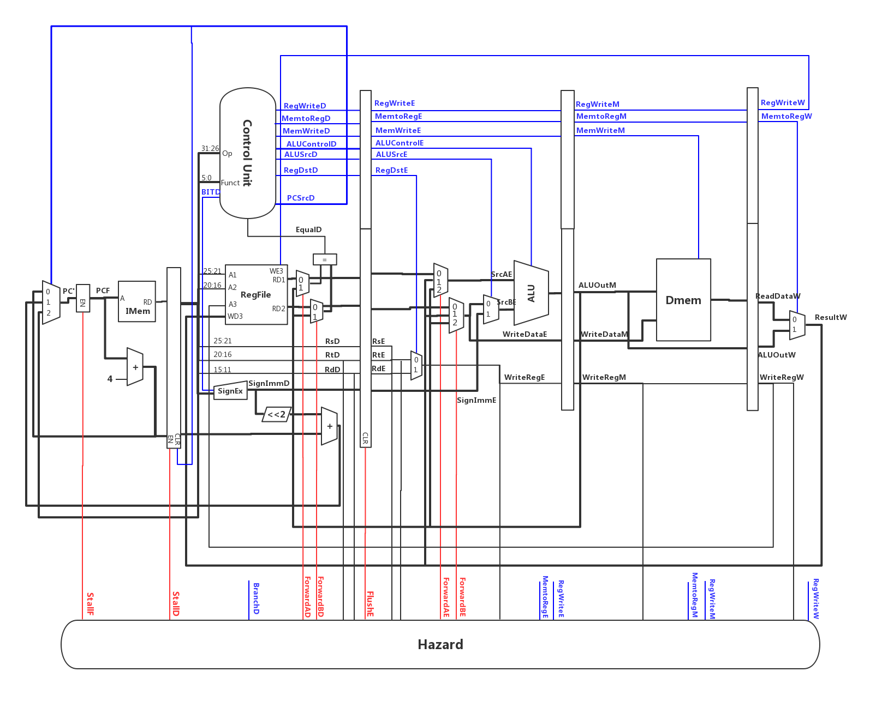

# MIPS CPU Design


CPU Design Project for *Introduction to Computer System II* 2019 Spring @ Fudan University, by [**Zuobai Zhang**](https://oxer11.github.io/)


## What's this

This is a semester-long project for the lab part of our ICS course. In this project, we have utilized Verilog language to design our own MIPS-mircoprocessors, which consist of four parts: SingleCycle Processor, MultiCycle Processor, Pipeline Processor, Pipeline Processor with cache. Additionally, we have also implemented a MIPS assembler to translate MIPS assembly into machine codes.

## How to use the MIPS assembler

### Prerequisites

```
Python 3.7.2
```

### Usage

```bash
# Clone this repository
$ git clone https://github.com/Oxer11/MIPS-Microprocessors.git

# Go into the repository
$ cd Assembler

# Translate 
$ python3 assmebler.py example
gcd.in
# gcd.out
 0x0 : addi $v0,$0,189      | 200200bd
 0x4 : addi $v1,$0,287      | 2003011f
 0x8 : main:                | 
 0x8 : beq $v0,$v1,end      | 10620007
 0xc : slt $at,$v0,$v1      | 0043082a
0x10 : beq $at,$0,run       | 10010003
0x14 : add $at,$v0,$0       | 00400820
0x18 : add $v0,$v1,$0       | 00601020
0x1c : add $v1,$at,$0       | 00201820
0x20 : run:                 | 
0x20 : sub $v0,$v0,$v1      | 00431022
0x24 : j main               | 08000002
0x28 : end:                 | 
0x28 : add $t3, $0, $0      | 00005820
# gcd.txt
{RAM[3], RAM[2], RAM[1], RAM[0]} <= 32'h200200bd;
{RAM[7], RAM[6], RAM[5], RAM[4]} <= 32'h2003011f;
{RAM[11], RAM[10], RAM[9], RAM[8]} <= 32'h10620007;
{RAM[15], RAM[14], RAM[13], RAM[12]} <= 32'h0043082a;
{RAM[19], RAM[18], RAM[17], RAM[16]} <= 32'h10010003;
{RAM[23], RAM[22], RAM[21], RAM[20]} <= 32'h00400820;
{RAM[27], RAM[26], RAM[25], RAM[24]} <= 32'h00601020;
{RAM[31], RAM[30], RAM[29], RAM[28]} <= 32'h00201820;
{RAM[35], RAM[34], RAM[33], RAM[32]} <= 32'h00431022;
{RAM[39], RAM[38], RAM[37], RAM[36]} <= 32'h08000002;
{RAM[43], RAM[42], RAM[41], RAM[40]} <= 32'h00005820;
...
```

To use the assembler, the following steps should be executed sequentially:
1. Clone this repository.
2. Put your test case in the directory Assembler/example and name it with file extensions '.in'.
3. Go into the directory Assembler and run the python program.
4. All the test cases in Assembler/example will be compiled and translated into machine code. Note that only files with extensions '.in' will be regarded as test cases.

After all steps above are done, two files with extensions '.out' and '.txt' and the same filename will be generated ('gcd.out' and 'gcd.txt' in our example). 'gcd.out' is a readable code combined the PC value, assembly and machine codes. And 'gcd.txt' looks like a Verilog code segment, which can be directly inserted into your **Imem** initialization module. However, since the name and length of our variables may be inconsistent, you have to change the source code for your use.

Equipped with this powerful tool, you can design your own test cases conveniently. If you have any suggestions for improving this imperfect assembler, please let us know, we will be super happy if you do (even happier if you send us a pull request). 

## Features

- For SingleCycle, we have implemented corresponding modules to support two instructions, **jal** and **jr**, for recursive function calls. For the purpose of testing our program, we have also constructed a test case **factorial.in**, which has been included in directory **Assembler/example**.
- In addition to these features above, we further design a 4-bit multiplier for MultiCycle. With the support of instruction **mul**, **real_factorial.in** become runnable and can be used to test your CPU. 
- **bubble_sort.in** is designed by [**Xiang Luo**](https://github.com/SunflowerAries) for the examination of the Cache part. Furthermore, experiments have been conducted for the purpose of comparing the performance of different replacement strategies and varisized caches.
- The MIPS Assembler makes it possible for you to create various test cases, with a handful of instructions. We would appreciate it if you send us a pull request for your imaginative cases.
- The illustrations of datapath are drawn via [ProcessOn](https://www.processon.com/), a free, powerful, interactive visualization library for diagramming. We have published four figures: [SingleCycle Datapath](https://www.processon.com/special/template/5d1c3314e4b00218c0103346), [MultiCycle Datapath](https://www.processon.com/special/template/5cc8ece0e4b01941c8c30f4d), [MultiCycle StateMachine](https://www.processon.com/view/5ccd8611e4b09eb4ac30bc39), [Pipeline Datapath](https://www.processon.com/special/template/5cd926f0e4b09db644c76aa7), and you can clone them for free and modify them as you like.


## Acknowledgments

- Thanks to my classmates [**Wenhao Huang**](https://github.com/EZ-hwh), [**Hongqin Li**](https://github.com/lihongqinzhuanyong), [**Xiang Luo**](https://github.com/SunflowerAries), [**Chenhao Wang**](https://github.com/wch19990119), [**Runpeng Xie**](https://github.com/Josep-h) (alphabet-order) for their enlightening discussion with me!
- Thanks to our lecturer, Chen Chen's guidance and suggestions, which inspire us to develop more intriguing features for our own CPU.
- Thanks to the future users of this repository. Hope this repository can help you design your characteristic CPU.
